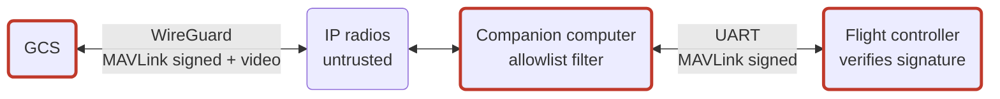

# P1: Security architecture and requirements for a notional small UAS

[](https://github.com/samyoon727ca/uas-sec-p1-architecture/actions/workflows/validate.yml)

This repo is the security architecture, threat model and derived requirements for a notional, unclassified small UAS. The UAS is built from open-source parts: a PX4 flight controller, a Linux companion computer, a ground control station, and a MAVLink telemetry/C2 link. P1 is the anchor for five follow-on repos, P2–P6. Each one implements and verifies requirements allocated here.

> **Notional and unclassified.** Built only from public sources: PX4 and MAVLink documentation, NIST, MITRE. It is not based on any real program or system. Assumptions are labeled as assumptions.

## Threat

65 threats, analyzed STRIDE per element across all 40 data-flow-diagram elements and mapped to MITRE EMB3D v2.0.2 and ATT&CK for ICS v19.2. Mission-impact ratings: 41 MI-1, 16 MI-2, 6 MI-3, 2 MI-4. 62 are mitigated and 3 accepted with rationale.

**Headline finding.** PX4 MAVLink signing uses one shared key. The FC, companion computer (CC), GCS and maintenance station (MSS) all hold it, so most MI-1 threats end the same way: an adversary holds that key, or runs code on a node that does.

**Priority threats:**

| Threat | Impact | Mitigated by |
|---|---|---|
| THR-010 Code execution on the CC yields full vehicle C2 | MI-1 | SR-001, SR-005, SR-008, SR-009 |
| THR-001 Spoofed GCS heartbeats suppress the data-link-loss failsafe | MI-1 | SR-001 (tested by VE-01) |
| THR-026, THR-027 Signing key read, replaced or deleted on the FC's SD card | MI-1 | SR-023, SR-025, SR-036 |
| THR-057 Unauthorized peer installs the first signing key | MI-2 | SR-011, SR-025, SR-037 |
| THR-021, THR-063 Malicious code enters signed artifacts | MI-1 | SR-031, SR-032, SR-033 |

The full analysis, STRIDE coverage matrix, accepted risks and residual risk are in [`docs/05-threat-model.md`](docs/05-threat-model.md).

## Requirements

44 derived "shall" requirements. Each one traces to at least one threat, is allocated to one component (CC 15, MSS 13, FC 9, GCS 7), and names a verification method (Test 23, Inspection 13, Demonstration 8) and an evidence repo.

Example: **SR-001** (CC) — the CC shall discard all traffic on its radio interface except WireGuard traffic from the provisioned GCS peer. Verified by Test (VE-01), with evidence from P3.

The full table with parent threats is in [`docs/07-requirements.md`](docs/07-requirements.md).

## Design

Radio → CC → FC (DD-01). C2 is protected in layers:

1. **WireGuard tunnel, GCS to CC (DD-02).** Carries MAVLink and video, and provides confidentiality across the untrusted RF link.
2. **CC allowlist (DD-04).** Filters MAVLink messages and commands. It is defense in depth, not an authentication point.
3. **MAVLink signing, GCS to FC.** This is design intent. It is not yet demonstrated with the pinned QGroundControl and PX4 versions (open item OI-01, closed by VE-02).

The FC–CC boundary uses only signed MAVLink over UART, and uXRCE-DDS is disabled (DD-03), because MAVLink signing doesn't cover DDS.



Read more:
- [System description](docs/01-system-description.md)
- [CONOPS](docs/02-conops.md)
- [Assumptions](docs/03-assumptions.md)
- [Architecture and design decisions](docs/04-architecture.md)

## Verification evidence

Traceability is checked automatically on every push. [`tools/validate_trace.py`](tools/validate_trace.py) fails the build if any of these hold:

- a threat is neither mitigated nor explicitly accepted;
- a requirement has no parent threat, has no allocated component, or can't be verified;
- an ID is orphaned;
- an architecture element has no threat analysis;
- a STRIDE category is applied to an element type it doesn't fit;
- an EMB3D or ATT&CK for ICS ID is not in the pinned catalog (revoked IDs included);
- a generated doc view has drifted from the CSVs.

The column rules are in [`data/README.md`](data/README.md).

Evidence for each requirement will come from the follow-on repos:

| Repo | Scope | Requirements | Status |
|---|---|---|---|
| P2 | Verified boot chain | 3 | Planned |
| P3 | PKI, key management and signed updates; SITL harness for VE-01 and VE-02 | 13 | Planned |
| P4 | Hardened CC image, MSS pipeline and supply chain | 14 | Planned |
| P5 | Hardware and firmware security assessment | 2 | Planned |
| P6 | RMF-as-code (OSCAL): configuration and procedure evidence | 12 | Planned |

## Repository map

| Path | Contents | Status |
|---|---|---|
| [`docs/01-system-description.md`](docs/01-system-description.md) | Purpose, scope, components, key material, software baseline | Draft for review |
| [`docs/02-conops.md`](docs/02-conops.md) | Mission phases, actors, modes, contingencies | Draft for review |
| [`docs/03-assumptions.md`](docs/03-assumptions.md) | Labeled assumptions `A-##` | Draft for review |
| [`docs/04-architecture.md`](docs/04-architecture.md) | Data flows, trust boundaries, C2 trust base, design decisions | Draft for review |
| [`docs/05-threat-model.md`](docs/05-threat-model.md) | STRIDE per element, EMB3D, ATT&CK for ICS, priority and accepted risks | Draft for review |
| [`docs/06-cyber-resiliency.md`](docs/06-cyber-resiliency.md) | NIST SP 800-160 Vol. 2 techniques mapped to the design | Planned |
| [`docs/07-requirements.md`](docs/07-requirements.md) | Requirement conventions; full table with parent threats | Draft for review |
| [`docs/08-verification-plan.md`](docs/08-verification-plan.md) | I/A/D/T methods; VE-01 (heartbeat spoofing test), VE-02 (signed-C2 demo) | Started |
| [`docs/references.md`](docs/references.md) | Sources, with pinned versions | Draft for review |
| [`data/`](data/) | Elements, threats, requirements, trace (CSV); pinned framework catalogs | Populated |
| `model/sysml/` | SysML v2 textual model | Planned |
| `brief/` | ~10-slide PDR-style brief (Marp) | Planned |

## Run the checks locally

```sh
python -m unittest discover -s tests
python tools/validate_trace.py
python tools/render_views.py --check
```

Python 3.11+. Standard library only.

## License

[Apache-2.0](LICENSE)
