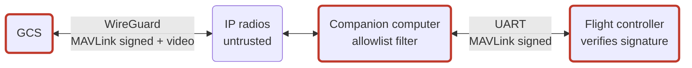

# P1: Security architecture and requirements for a notional small UAS

[](https://github.com/samyoon727ca/uas-sec-p1-architecture/actions/workflows/validate.yml)

This repo is the security architecture, threat model and derived requirements for a notional, unclassified small UAS. The UAS is built from open-source parts: a PX4 flight controller, a Linux companion computer, a ground control station, and a MAVLink telemetry/C2 link. P1 is the anchor for five follow-on repos, P2–P6. Each one implements and verifies requirements allocated here.

> **Notional and unclassified.** Built only from public sources: PX4 and MAVLink documentation, NIST, MITRE. It is not based on any real program or system. Assumptions are labeled as assumptions.

## Threat

_Status: architecture complete; STRIDE-per-element analysis next._

**Headline finding from the architecture.** PX4 MAVLink signing uses one shared key. The FC, companion computer (CC), GCS and maintenance station (MSS) all hold it, so compromising any of them gives full vehicle C2. The CC is the most exposed: it terminates the RF link, runs general-purpose Linux, and stays connected throughout flight. The threat model will carry CC compromise as a top threat. Five other inputs come out of the architecture:

- no per-node attribution of signed commands;
- the signing key file on the FC's SD card;
- the provisioning window before any key exists;
- the four message types PX4 accepts unsigned;
- GCS-loss detection that relies on unsigned heartbeats.

See [§4.2](docs/04-architecture.md#42-c2-trust-base) and [`docs/05-threat-model.md`](docs/05-threat-model.md).

## Requirements

_Status: planned._ Each "shall" requirement will trace to a parent threat, be allocated to one component, and name a verification method and evidence repo. See [`data/requirements.csv`](data/requirements.csv).

## Design

Radio → CC → FC (DD-01). C2 is protected in layers:

1. **WireGuard tunnel, GCS to CC (DD-02).** Carries MAVLink and video, and provides confidentiality across the untrusted RF link.
2. **CC allowlist (DD-04).** Filters MAVLink messages and commands. It is defense in depth, not an authentication point.
3. **MAVLink signing.** Verified at the FC, end to end from the GCS.

The FC–CC boundary uses only signed MAVLink over UART, and uXRCE-DDS is disabled (DD-03), because MAVLink signing doesn't cover DDS.



Read more:
- [System description](docs/01-system-description.md)
- [CONOPS](docs/02-conops.md)
- [Assumptions](docs/03-assumptions.md)
- [Architecture and design decisions](docs/04-architecture.md)

## Verification evidence

Traceability is checked automatically on every push. [`tools/validate_trace.py`](tools/validate_trace.py) fails the build if any of these hold:

- a threat is neither mitigated nor explicitly accepted;
- a requirement has no parent threat, has no allocated component, or can't be verified;
- an ID is orphaned;
- an architecture element has no threat analysis.

Until the threat model lands, CI runs with `--allow-unanalyzed`, so elements without threat analysis show up as warnings instead of failures.

The column rules are in [`data/README.md`](data/README.md).

Evidence for each requirement will come from the follow-on repos:

| Repo | Scope | Status |
|---|---|---|
| P2 | Verified boot chain | Planned |
| P3 | PKI, key management and signed updates | Planned |
| P4 | Hardened embedded Linux and supply-chain pipeline | Planned |
| P5 | Hardware and firmware security assessment | Planned |
| P6 | RMF-as-code (OSCAL) | Planned |

## Repository map

| Path | Contents | Status |
|---|---|---|
| [`docs/01-system-description.md`](docs/01-system-description.md) | Purpose, scope, components, key material, software baseline | Draft for review |
| [`docs/02-conops.md`](docs/02-conops.md) | Mission phases, actors, modes, contingencies | Draft for review |
| [`docs/03-assumptions.md`](docs/03-assumptions.md) | Labeled assumptions `A-##` | Draft for review |
| [`docs/04-architecture.md`](docs/04-architecture.md) | Data flows, trust boundaries, C2 trust base, design decisions | Draft for review |
| [`docs/05-threat-model.md`](docs/05-threat-model.md) | STRIDE per element, EMB3D, ATT&CK for ICS | Planned |
| [`docs/06-cyber-resiliency.md`](docs/06-cyber-resiliency.md) | NIST SP 800-160 Vol. 2 techniques mapped to the design | Planned |
| [`docs/07-requirements.md`](docs/07-requirements.md) | Requirement conventions | Planned |
| [`docs/08-verification-plan.md`](docs/08-verification-plan.md) | I/A/D/T methods and the evidence map | Planned |
| [`docs/references.md`](docs/references.md) | Sources, with pinned versions | Draft for review |
| [`data/`](data/) | Elements, threats, requirements, trace (CSV) | Elements populated |
| `model/sysml/` | SysML v2 textual model | Planned |
| `brief/` | ~10-slide PDR-style brief (Marp) | Planned |

## Run the checks locally

```sh
python -m unittest discover -s tests
python tools/validate_trace.py
```

Python 3.11+. Standard library only.

## License

[Apache-2.0](LICENSE)
