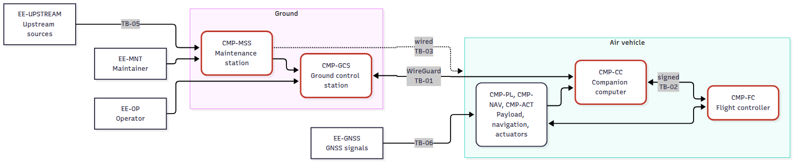
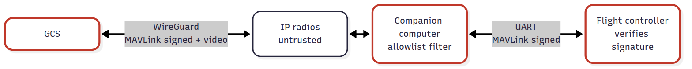

<!-- _class: lead -->
<!-- _paginate: false -->

# P1: Security architecture and requirements

## Notional small UAS · PDR-style brief

A PX4 flight controller, a Linux companion computer, a ground control station and a MAVLink C2 link, secured from threat model to verification plan.

github.com/samyoon727ca/uas-sec-p1-architecture · every number here is generated from the repo's checked data

---

## 1. System, mission and scope

**Mission:** generic survey/ISR. The vehicle flies a pre-planned pattern, collects EO imagery, streams video and returns.

| Component | Basis |
|---|---|
| Flight controller (FC) | PX4 v1.18 on a Pixhawk-standard FMU |
| Companion computer (CC) | ARM64 Linux; WireGuard endpoint, MAVLink router, command filter |
| Ground control station (GCS) | QGroundControl v5.1.5 on a Linux laptop |
| Maintenance and support station (MSS) | Builds, signs and loads software; provisions keys |
| IP data-link radios | **Untrusted transport** (A-05) |

**Adversaries (A-08):** RF-proximate with an SDR · physical access · supply chain.
**Constraint (A-11):** a security fault must lead to a safe flight state.
**Out of scope:** airworthiness, waveform and EW, RC link.

---

## 2. Architecture and trust boundaries

**Every C2 path runs GCS → CC → FC** (DD-01). Red outline: holders of the signing key. 46 elements in all.

TB-01 air–ground RF · TB-02 flight-critical / mission computing · TB-03 air-vehicle physical · TB-04 GCS host · TB-05 supply chain · TB-06 GNSS RF

---

## 3. Headline finding: one shared signing key

- PX4 MAVLink signing uses **one 32-byte key** on the FC, CC, GCS and MSS, enforced on every link including USB.
- **Any key holder can forge any command,** so the C2 trust base is four nodes.
- **The CC is the most exposed.** It terminates the RF link, runs general-purpose Linux and stays connected throughout flight.
- **Signing first ships in PX4 v1.18.** It is absent from v1.17.0 (checked in the source), so the baseline is v1.18 (DD-06). PX4's own docs say its signing implementation is unaudited.

**Inputs to the threat model:** CC compromise · no per-node attribution · the key file on the FC's SD card · the first-key provisioning window · the four messages PX4 accepts unsigned · GCS-loss detection that relies on unsigned heartbeats.

---

## 4. Threat model: 65 threats, STRIDE per element

- **Coverage:** 40 elements, using Microsoft's STRIDE-per-element chart, which the validator enforces.
- **Framework mapping:** EMB3D v2.0.2 (43 threats) and ATT&CK for ICS v19.2 (52). IDs are checked against pinned catalogs, so revoked IDs fail.
- **Impact, consequence only:** 41 MI-1 · 16 MI-2 · 6 MI-3 · 2 MI-4. 62 mitigated, 3 accepted with rationale.

| Priority threat | Impact | Mitigated by |
|---|---|---|
| THR-010 Code execution on the CC yields full vehicle C2 | MI-1 | SR-001, SR-005, SR-008, SR-009 |
| THR-001 Spoofed GCS heartbeats suppress the data-link-loss failsafe | MI-1 | SR-001 (tested in VE-01) |
| THR-026/027 Key file on the FC's SD card read, replaced or deleted | MI-1 | SR-023, SR-025, SR-036 |
| THR-057 Unauthorized peer installs the first signing key | MI-2 | SR-011, SR-025, SR-037 |
| THR-021/063 Malicious code in signed artifacts | MI-1 | SR-031, SR-032, SR-033 |

---

## 5. Design: C2 protected in three layers

| Decision | What it does |
|---|---|
| DD-02 WireGuard between GCS and CC | Confidentiality over the untrusted link. **Not FIPS-approved**, so a DoD deployment would likely use IPsec with a validated module |
| DD-03 MAVLink over UART only at the FC–CC boundary | uXRCE-DDS disabled, because MAVLink signing does not cover it |
| DD-04 CC allowlist | Defense in depth, not authentication. Drops the shell, MAVLink FTP, `SETUP_SIGNING` and spoofable unsigned messages |
| DD-05 `NAV_DLL_ACT` = Return | PX4's default is Disabled. Jamming, tunnel loss and CC failure all appear as link loss |

---

## 6. Requirements: 44 derived "shall" statements

- **Allocation:** CC 15 · MSS 13 · FC 9 · GCS 7.
- **Method:** Test 23 · Inspection 13 · Demonstration 8.
- **Traceability:** every requirement traces to a threat, is allocated to one component and is verifiable. CI enforces all three.

| Example | Requirement |
|---|---|
| SR-001 | The CC shall discard all traffic on its radio interface except WireGuard traffic from the provisioned GCS peer |
| SR-020 | The FC shall run with the GNSS spoofing and jamming checks enabled (`EKF2_GPS_CHECK` bits 9 and 11). PX4's default leaves jamming off |
| SR-037 | The MSS shall provision the first signing key on the FC over USB at first power-up, before any other link is connected |

**Resiliency (NIST SP 800-160 Vol. 2):** 11 of 14 techniques, through 16 of 50 approaches. **Gap: Path Diversity.** No C2 path bypasses the CC (OI-03).

---

## 7. Verification: every requirement has a planned event

16 verification events cover all 44 requirements. Each event's method and evidence repo match its requirements, and the validator enforces that.

| Repo | Builds | Requirements | Events |
|---|---|---|---|
| P2 | Verified boot (CC and FC) | 3 | VE-07, VE-08 |
| P3 | Keys, signing, SITL harness | 13 | VE-01 to VE-06 |
| P4 | Hardened CC image, MSS pipeline, supply chain | 14 | VE-09 to VE-11 |
| P5 | Hardware and debug-port assessment | 2 | VE-12, VE-13 |
| P6 | RMF-as-code: configuration and procedure evidence | 12 | VE-14 to VE-16 |

- **VE-01:** a SITL test injects spoofed GCS heartbeats with the tunnel down. Its control run bypasses the CC to show the test can detect the threat.
- **VE-02:** signed C2 with QGroundControl v5.1.5 and PX4 v1.18. **Until it passes, end-to-end signing is design intent only.**

---

## 8. Rigor: a machine-checked digital thread

- **Five CSVs are the single source of truth:** elements, threats, requirements, trace and verification.
- **The CI validator fails the build** on an orphaned ID, an unresolved threat, a misapplied STRIDE category, an unknown EMB3D, ATT&CK or SP 800-160 entry, or a requirement without a matching verification event.
- **Generated, drift-checked views:** the doc tables and the SysML v2 threats, requirements and verification cases.
- **SysML v2 model** (architecture hand-written, security content generated) validates on the **OMG SysML v2 Pilot Implementation** in CI, headless, against a SHA-256-pinned release: 0 errors, 0 warnings.
- **Supply chain:** every GitHub Action is pinned by commit SHA, toolchains by lockfile or hash, and the validator uses the standard library only.

---

## 9. Residual risk and open items

**Residual risk:**
- **Shared signing key.** Mitigations make a key-holder compromise less likely and more evident, but don't change its consequence.
- **RF jamming** cannot be prevented within scope. Its effect is bounded to a Return.
- **GNSS spoofing that the receiver does not report** goes undetected.
- **Physical tampering** is detected (seals), not prevented.
- **Hardware supply-chain insertion** before receipt.

| Open item | Closed by |
|---|---|
| OI-01 QGroundControl v5.1.5 ↔ PX4 v1.18 signing interoperability | VE-02 (P3) |
| OI-02 Per-node authentication to the FC (PX4 signing has one key for all nodes) | Trade study (P3) |
| OI-03 No independent C2 path (Path Diversity) | Later P1 revision |

---

## 10. Next: P2–P6 produce the evidence

| Order | Repo | First deliverable |
|---|---|---|
| 1 | **P2** Verified boot | Signed boot chain and TPM-sealed keys on a dev board (VE-07); PX4 Bootloader Secure Boot (VE-08) |
| 2 | **P3** PKI and signing | SITL harness; VE-01 and VE-02 close THR-001 and OI-01 |
| 3 | **P4** Supply chain | Hardened CC image, command filter, SBOM and provenance pipeline (VE-09 to VE-11) |
| 4 | **P5** Hardware test | Seal and debug-port assessment on an owned device (VE-12, VE-13) |
| 5 | **P6** RMF-as-code | OSCAL SSP with configuration evidence (VE-14 to VE-16) |

Each repo opens the same way: **threat → requirement → design → verification evidence**, traced back to P1.
