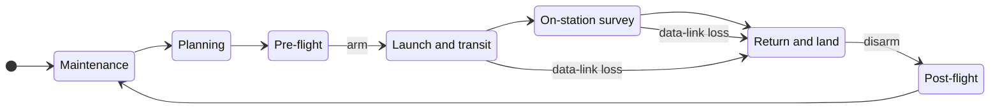

# 2. Concept of operations

One operator flies one vehicle within radio line of sight. The vehicle flies a pre-planned survey pattern, stores EO imagery on board, and streams video to the GCS. After landing, the imagery is offloaded over a wired link. Every C2 path runs GCS → CC → FC (DD-01).

## 2.1 Actors

| Actor | Role | Interacts through |
|---|---|---|
| Operator (EE-OP) | Pilot in command and mission operator | GCS |
| Maintainer (EE-MNT) | Builds and loads software, provisions keys, offloads data | MSS |

Both are trusted but may make mistakes. Adversary capabilities are set in A-08.

## 2.2 Mission phases

| Phase | Activities | Security-relevant events |
|---|---|---|
| Maintenance | Load signed software. Set baseline parameters, including DD-05. Provision keys | All on the ground, disarmed and wired (A-14). The only phase in which keys are installed or changed |
| Planning | The operator builds the mission on the GCS | Plan stored on the GCS (DS-GCS-DATA) |
| Pre-flight | Power on. Verified boot (P2). WireGuard tunnel comes up. Signed mission upload. Arming checks | From arming onward, PX4 rejects `SETUP_SIGNING` [PX4-SIGN] |
| Launch and transit | Fly to the survey area | Telemetry and C2 over the tunnel |
| On-station survey | Collect imagery and stream video. CC autonomy may command the payload and the FC | CC-originated commands to the FC are signed with the shared key (§4.2) |
| Return and land | Fly home and land | Return can also be triggered by the data-link-loss failsafe |
| Post-flight | Disarm. Offload imagery and logs to the MSS over wired links | Offload flows DF-14 and DF-15 cross TB-03 |

## 2.3 Operating modes

| Mode | Vehicle state | Changes allowed |
|---|---|---|
| Maintenance | Disarmed, wired to the MSS | Software load, key provisioning, parameter baseline |
| Operational | Powered, link up, armed in flight | Mission and parameter changes through signed MAVLink. No key changes while armed |
| Contingency | Failsafe active | PX4 failsafe actions only |

## 2.4 Contingencies

- **Data-link loss.** Jamming, a tunnel failure and a CC failure all appear to the FC as data-link loss, because every C2 path runs through the CC (DD-01). PX4 enters the GCS-loss failsafe when no GCS heartbeat has arrived for `COM_DL_LOSS_T` seconds (default 10). The failsafe then runs `NAV_DLL_ACT`. PX4's default for `NAV_DLL_ACT` is Disabled, so the baseline sets Return (DD-05). GCS heartbeats are accepted unsigned, so spoofed heartbeats could hold this failsafe off. That is threat THR-001, mitigated by SR-001 and verified by VE-01.
- **GNSS degradation or spoofing.** PX4's position-loss failsafes apply. Their settings are defined with the requirements.
- **RC loss.** Not applicable: there is no RC link (A-07). The RC-loss failsafe (`NAV_RCL_ACT`) is out of scope.
