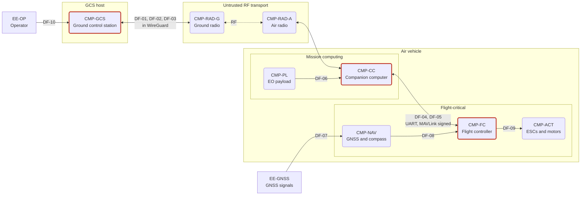
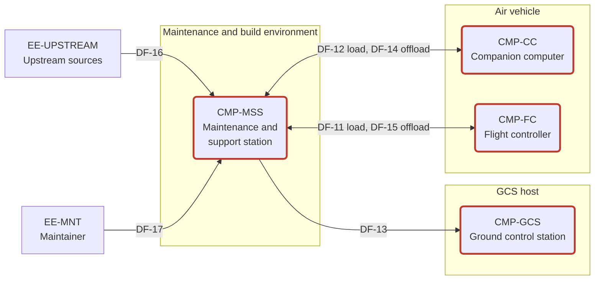
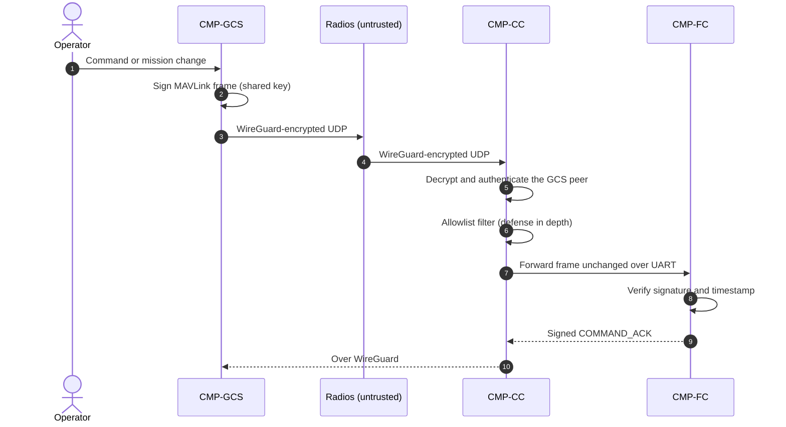

# 4. Architecture

All command and control (C2) passes through the companion computer (CC) on its way to the flight controller (FC). A WireGuard tunnel protects the air-ground link, and PX4 MAVLink signing authenticates commands end to end at the FC. PX4 uses one shared signing key, so every key holder is inside the C2 trust base: FC, CC, GCS and MSS. The CC is the most exposed of them.

Element IDs match [`data/elements.csv`](../data/elements.csv). Source tags such as [PX4-SIGN] point to [references](references.md).

## 4.1 Data flow diagrams

**Operational flows (in flight)**

**Maintenance and supply-chain flows (on the ground, wired; A-14)**

*Red outline: holders of the shared MAVLink signing key, which make up the C2 trust base (§4.2). The dotted edge is the RF hop.*

**Modeling conventions:**
- **Data stores.** Each `DS-*` element is reached only through its host process. Those flows are implicit, and their threats are recorded on the store. The stores and their hosts are listed in [`data/elements.csv`](../data/elements.csv).
- **Air-ground link.** DF-01 to DF-03 are logical GCS-to-CC flows carried by the radios. The radios are modeled as processes in their own right because they have their own threats, such as compromise of a radio that sits on the CC's Ethernet segment.

| Trust boundary | Separates | Crossed by |
|---|---|---|
| TB-01 Air-ground RF link | Ground radio from air radio | DF-01, DF-02, DF-03 |
| TB-02 Flight-critical / mission computing | FC (RTOS) from CC (Linux) | DF-04, DF-05 |
| TB-03 Air vehicle physical | On-board storage and ports from anyone with physical access | DF-11, DF-12, DF-14, DF-15 |
| TB-04 GCS host | GCS from operator, data link and maintenance media | DF-01, DF-02, DF-03, DF-10, DF-13 |
| TB-05 Supply chain | MSS build and signing environment from upstream sources | DF-16 |
| TB-06 GNSS RF | Navigation receiver from the signal environment | DF-07 |

## 4.2 C2 trust base

**PX4 signing facts.** Source: [PX4-SIGN], [PX4-HARD].

| Property | PX4 behavior |
|---|---|
| Key | One 32-byte secret shared by every node. PX4's guide says to provision the same key on all ground stations and companion computers that talk to the vehicle |
| Enforcement | Once a key exists, signing is enforced on all links, including USB |
| Unsigned exceptions | `HEARTBEAT`, `RADIO_STATUS`, `ADSB_VEHICLE` and `COLLISION` are always accepted unsigned |
| First key | Accepted unsigned, on any link, while no key exists |
| Key changes | Must be signed with the current key. Rejected while armed. No automatic rotation |
| Storage | `/mavlink/mavlink-signing-key.bin` on the FC's SD card (key plus timestamp, 40 bytes). Anyone with SD-card access can read, replace or delete it |
| Lost key | Recovery is physical only: delete the file from the SD card, or reflash over SWD/JTAG |
| Protection | Authentication and integrity, with timestamp-based replay protection. No confidentiality |
| Assurance | "The signing protocol was audited when it was drafted, but PX4's implementation of it has not been." |

**Key holders:**

| Holder | MAVLink signing key | WireGuard | Why it holds the key |
|---|---|---|---|
| CMP-FC | DS-FC-KEY (SD card) | — | Verifies and signs every frame |
| CMP-CC | DS-CC-CRED | Own key pair | Its autonomy and payload functions send commands to the FC (DF-04), so its frames must be signed |
| CMP-GCS | DS-GCS-CRED | Own key pair | Originates C2 (DF-01) |
| CMP-MSS | DS-MSS-KEYS (master) | Generates and provisions both pairs | Signing covers USB, so the maintenance connection (DF-11) must sign |

**What follows for the threat model:**

1. **Any key holder can forge any command.** Compromising the CC, GCS or MSS, or reading DS-FC-KEY, gives full vehicle C2. That includes the actions PX4 lists as at risk: parameter writes, mission upload, arm/disarm, flight termination and shell access through `SERIAL_CONTROL` [PX4-HARD].
2. **The CC is the most exposed holder.**
   - It terminates the tunnel and parses MAVLink arriving over the RF link.
   - It runs general-purpose Linux, the largest software surface on the vehicle.
   - It is powered and connected throughout flight.

   CC compromise will be carried into the threat model as a top threat. Protecting it is the job of P2 (verified boot) and P4 (hardened image and supply chain).
3. **No per-node attribution.** The FC can't tell which holder signed a frame. Repudiation can't be resolved from MAVLink alone.
4. **The key file is a physical target.** With access to the SD card, an adversary can read the key (and become a holder), replace it, or delete it (which disables signing).
5. **Provisioning window.** Before a key exists, any peer that reaches any FC link can install its own key. That locks out the GCS, and recovery is physical.
6. **Unsigned allowlist.** Anyone who reaches an FC link can spoof the four messages PX4 accepts unsigned. `HEARTBEAT` matters most: PX4 derives GCS liveness from heartbeats with `MAV_TYPE_GCS` [PX4-SRC], so spoofing them can suppress the data-link-loss failsafe (DD-05).

## 4.3 Command path and protection layers

| Layer | Protects | Does not protect |
|---|---|---|
| WireGuard, GCS to CC (DD-02) | Confidentiality and integrity across TB-01 for MAVLink and video. Each peer is authenticated by its own static public key. RF-injected packets are dropped before any MAVLink parsing, provided the CC accepts only WireGuard on its radio interface (to be stated as a requirement) | Anything after the CC decrypts. A compromised CC. Jamming |
| CC allowlist (DD-04) | Shrinks the command surface reachable from the link | Not an authentication point. Doesn't apply if the CC is compromised |
| MAVLink signing, GCS or CC to FC | End-to-end integrity: the frame came from *some* key holder. Replay protection | Confidentiality. Per-node identity. The four unsigned messages. Video (DF-03) and any non-MAVLink path |

## 4.4 Design decisions

| ID | Decision | Rationale | Alternative considered | Status |
|---|---|---|---|---|
| DD-01 | The IP radio connects to the CC; the CC connects to the FC | One node terminates link encryption and filters traffic before the FC. The FC exposes no IP stack to the link | Radio straight to the FC. The FC would then have to terminate link encryption itself. **Consequence of this choice:** if the CC fails, the link is lost, so the data-link-loss failsafe must be set (DD-05) | Approved |
| DD-02 | WireGuard tunnel between GCS and CC carries MAVLink and video. MAVLink signing stays end to end inside it | Signing gives no confidentiality, A-05 takes no credit for the radios, and A-09 treats flight plans and imagery as sensitive. WireGuard uses fixed primitives: Curve25519, ChaCha20-Poly1305, BLAKE2s, HKDF [WG] | IPsec (IKEv2), whose negotiable suites include AES-GCM, if a deployment requires a specific algorithm suite or a validated crypto module. WireGuard has no cipher agility | Approved |
| DD-03 | TB-02 is MAVLink 2 over UART only. The uXRCE-DDS client is disabled (`UXRCE_DDS_CFG` = 0), and so is every unused MAVLink instance | MAVLink signing lives in PX4's MAVLink module, so a uXRCE-DDS/ROS 2 path would bypass it. UART keeps an IP stack off the FC side of TB-02. Unused instances matter: the `px4_fmu-v6x` board defaults enable MAVLink on Ethernet (`MAV_2_CONFIG` = 1000) [PX4-SRC] | ROS 2 over uXRCE-DDS, which would need its own authentication and a threat-model update | Approved |
| DD-04 | The CC filters MAVLink with an allowlist of messages and commands. It is defense in depth, not an authentication point | Limits what the link can reach, even with a valid signature. mavlink-router supports per-endpoint message-ID and source filters [MAVROUTER]. Its configuration has no command-ID (`MAV_CMD`) filter, so command filtering needs a small custom filter on the CC (P4). That filter is a new parser, and a fuzzing target (P7) | None | Approved. The list itself is set in requirements |
| DD-05 | GCS-link-loss failsafe `NAV_DLL_ACT` = 2 (Return) | The PX4 default is 0 (Disabled). Under DD-01, jamming, a tunnel failure or a CC failure all show up as data-link loss. The `COM_DL_LOSS_T` timeout (default 10 s) will be set in requirements [PX4-SRC] | Land (3), for areas where returning is unsafe | Proposed |
| DD-06 | PX4 baseline is v1.18. Analysis uses tag `v1.18.0-rc1`; re-pin to `v1.18.0` when it is released | MAVLink signing, the hardening guide, Bootloader Secure Boot and SBOM generation are absent from tag `v1.17.0` and present in the v1.18 pre-releases [PX4-SRC], [PX4-1.18] | v1.17.0 stable without signing. C2 integrity would then rest on WireGuard alone, and DF-04 would be unauthenticated | Proposed. Owner decision |
